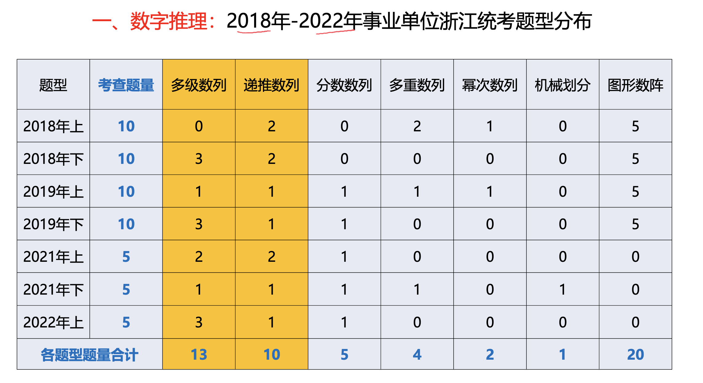
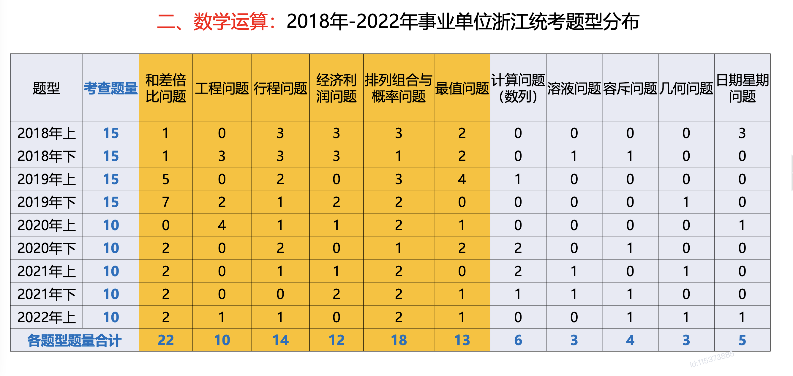
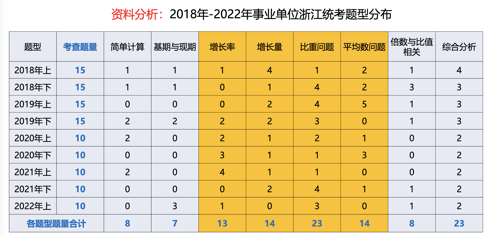
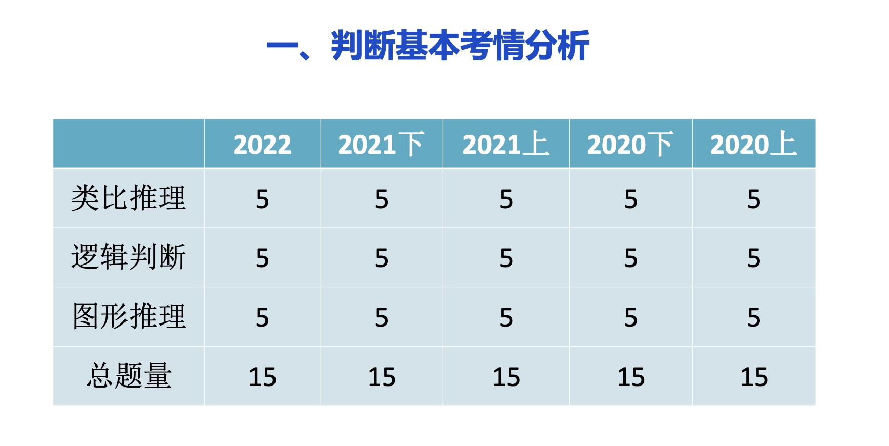
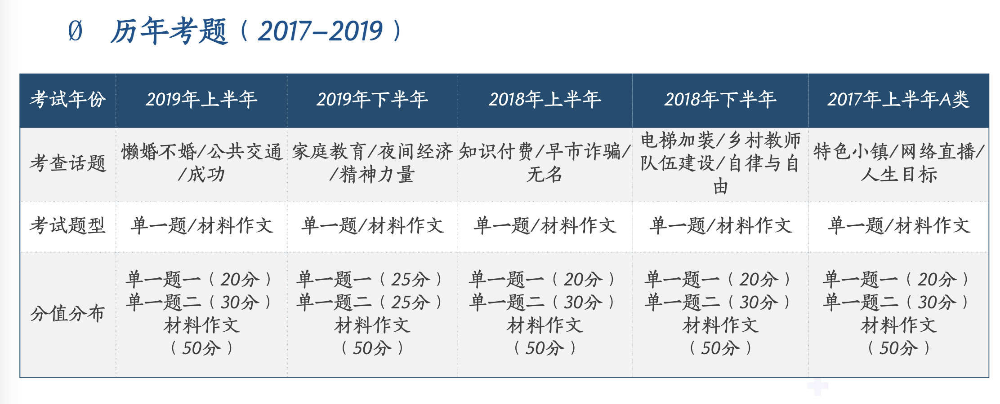
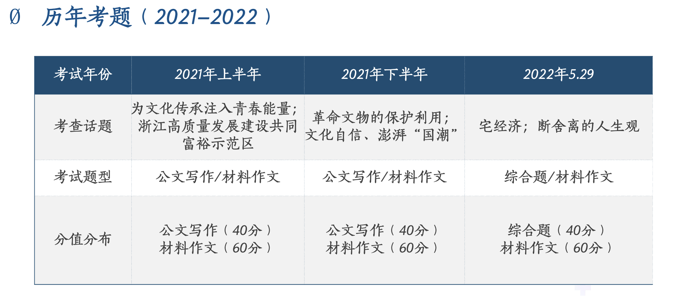

## 一、备考

### （一）言语理解与表达

#### 1.考情分析

**必考**

- **逻辑填空**（7-8）
- 片段阅读：**中心理解**（1-4），细节判断（0-2）
- 语句表达：**语序排序**（1-2），语句填空（0-2）

**选考**

- 片段阅读：标题填入题（0-1），词句理解题（0-1）
- 语句表达：接语选择题（0-1）

#### 2.经验分享

##### （1）备考流程

- 听课：听完课默写**知识框架**
- 模块刷题：按照知识框架的顺序进行**模块刷题(不要限时，保证准确李)**
- 限时模块刷题：在模块刷题准确率稳定在80%后，开始限时（舍弃无法提高的模块）
- 套卷刷题：限时刷题准确率稳定在70%-80%后，知识点混合刷题
- 复盘

##### （2）备考思维

- 1.不要无脑刷题
- 2.先质后量，先慢后快，先懂再巧
  - 质：吃透本道题（考点？思路？错误选项特征？）
  - 量：加大题量，并限时训练
- 时刻反思，养成复盘习惯
  - 复盘：三问
    - 本题考点是什么
    - 本题思路是什么
    - 为什么我选错了
- 由学生思维转变为老师思维
  - 不要问：为什么D选项是对的，而要问为什么A项是错的
  - 记录自己选错选项的特征或理由，下次避免踩坑
  - 对比择优

##### （3）备考心态

- 目标：切合实际，量体裁衣
- 过程
  - 保持清醒，持续输出
  - 问题导向，管理好自己的情绪
- 结果：尽力而为，不留遗憾

### （二）数资

#### 1.考情分析

##### （1）数量关系（15）

**数字推理（5）**

- **多级数列**（1-3）
- **递推数列**（1-2）
- **分数数列**（1）
- 多重数列（0-1）
- 幂次数列（0）
- 机械划分（0-1）
- 图形数列（0）

**考查特点**

- 考查以多级数列，递推数列为主
- 考试规律比较常规，整体难度不大
- 一题多解，殊途同归

**2.数学运算（10）**

- 和差倍比问题（2）
- 工程问题（0-1）
- 行程问题（0-2）
- 经济利润问题（0-2）
- 排列组合与概率问题（1-2）
- 最值问题（0-2）
- 计算问题（数列）（0-2）
- 溶液问题（0-1）
- 容斥问题（0-1）
- 几何问题（0-1）
- 日期星期问题（0-1）

**考查特点**

- 考查类型丰富，题量大
- 考查多为思考型问题，套路型题目考查较少

##### （2）资料分析（10）

- 简单计算（0-2）
- 基期与现期（0-3）
- **增长率（0-4）**
- **增长量（0-2）**
- **比重问题（1-4）**
- **平均数问题（0-3）**
- 倍数与比值相关（0-1）
- 综合分析（2）

**考查特点**

- 考查以综合材料为主，数据构成较复杂
- 基础题：提升题：超难题，6:3:1
- 有一些题目需要回归到最基础的基础公式计算，讨巧题目考查较少，多公式结合题目较多

#### 2.备考指导

##### （1）数字推理

- 了解各类数列特点，掌握其解题逻辑
- 基础数列和常考数列的特点烂熟于心
- 加强对多级数列，递推数列的练习
- 每天练习，保持数字敏感度
- 目标：正确率80%+,保四争五

##### （2）数学运算

- 必做题：和差倍比，工程，经济，典型最值，容斥，溶液         ——基本是常规题
- 突破题：排列组合与概率，行程
- 随机应变题：几何问题，非典型最值，数列
- 目标：连猜带做，50%+

##### （3）资料分析

- 基本概念，公式烂熟于心
- 材料阅读，计算能力加强练习
- 每天练习，培养选项意识
- 简单计算：必做，注意细节，陷阱
- 综合分析：遇难则跳
- 其他考点：熟记题型特征对应公式，结合选项快速估算
- 目标：正确率80%+

##### （4）复习策略

- 先理论，再刷题
- 先保证准确率，再提速
- 先确保优势题型，再补足短板

### （三）判断（15）

#### 1.考情分析

- 1.类比推理（5）
  - 逻辑对应（2-4）
- 2.逻辑判断（5）
  - 论证削弱|加强（2-5）
- 3.图形推理（5）
  - 数量规律（2-4）

#### 2.备考建议

- 理论课（2遍以上，旨在学习基础知识）
- 真题课（总结真题的高频考点）
- 强化课（刷题提高，熟练运用知识点）
- 专项课（根据个人情况有选择地听）
- 模考课（有余力，再去做）

#### 3.如何刷题

- 图形推理-每天10-15题（熟悉技巧）
- 类比推理-每天10题（见多才能识广）
- 逻辑判断-每类每天3-5题（判断题型和方法）

### （四）综应

#### 1.考情分析

- 考试时长：10:00-12:00
- 题量分值：单一题/综合题/公文写作+材料作文题；100分
- 笔试内容
  - 主要测查应考人员的阅读理解能力，归纳概括能力，逻辑思维能力，综合分析能力，解决问题能力和文字综合能力等
  - 测查题型包括案例（材料）分析题，论述评价题，校阅改错题，材料作文题，每次考试从上述题型中组合选取

#### 2.出题形式

根据材料1-4,谈谈你对“宅”经济的理解

要求：全面，准确，深刻，有条理，字数不超过600字

#### 3.做题流程

- 认真审题，完成题干要求的任务
- 研读材料
- 组织答案

